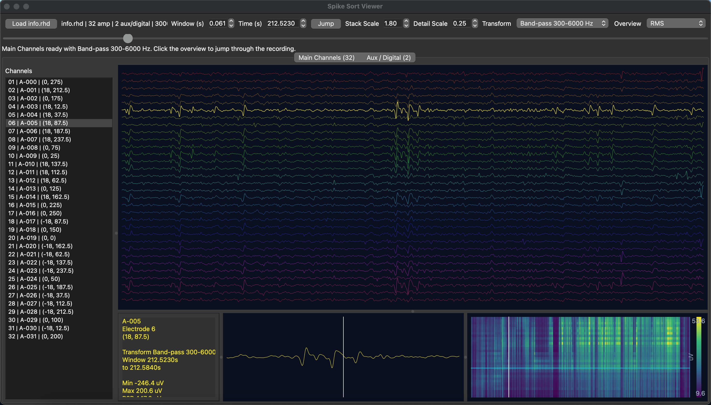

# Native Spike Viewer Build



`spike_viewer_native` C++ executable built with Qt Widgets and CMake.

## Requirements

- CMake 3.21+
- Qt 5.15 with `Core`, `Gui`, `Widgets`, `Concurrent`, and `Xml`

On this machine, Homebrew Qt 5 is already available at `/opt/homebrew/opt/qt@5`.

## Build

```bash
cmake -S . -B build -DCMAKE_BUILD_TYPE=Release -DCMAKE_PREFIX_PATH=/opt/homebrew/opt/qt@5
cmake --build build -j
```

If you are on Intel macOS and Qt is installed under `/usr/local`, use:

```bash
cmake -S . -B build -DCMAKE_BUILD_TYPE=Release -DCMAKE_PREFIX_PATH=/usr/local/opt/qt@5
cmake --build build -j
```

## Run

```bash
./build/spike_viewer_native
```

Optional: pass an `info.rhd` path directly.

```bash
./build/spike_viewer_native /absolute/path/to/info.rhd
```

## Notes

- The native viewer keeps the same major interaction model as the Python version:
  - top stacked all-channel trace view
  - per-channel stats panel
  - detail trace view
  - overview modes: `Activity`, `Events`, `RMS`, `Peak-to-Peak`, `Population`, `Motion`
  - click the overview to jump in time
- The channel browser is split into two tabs:
  - `Main Channels` for the A-series electrophysiology channels (for example `A-000` through `A-031`)
  - `Aux / Digital` for AUX, DIGITAL IN, and other non-primary channels
  - `digitalin.dat` channels are loaded as real TTL bit signals rather than reusing amplifier traces
- The transform selector supports common electrophysiology display filters:
  - `Raw`
  - `High-pass 300 Hz`
  - `Band-pass 300-6000 Hz`
  - `Band-pass 500-3000 Hz`
  - `Low-pass 250 Hz`
  - `Notch 60 Hz`
- Digital channels bypass analog filters and the detail pane has its own `Detail Scale` control.
- The implementation uses memory-mapped `amplifier.dat` access and a background worker for the overview analysis so large recordings stay responsive.
